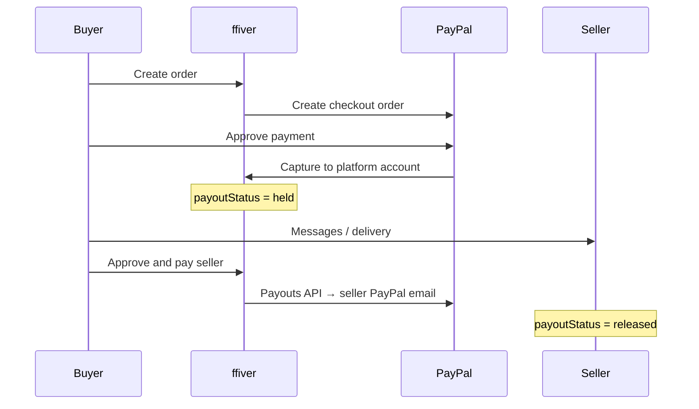

# How payments work on ffiver

## Previous behavior (broken for sellers)

All PayPal payments were captured into the **platform** PayPal account only. There was no seller PayPal email, no payout step, and no way for freelancers to receive money through the app.

## Current behavior

### Steps

1. **Seller** adds PayPal email in **Account settings** (required before buyers can order).
2. **Buyer** checks out; payment is captured to the platform PayPal merchant account.
3. Platform fee (default **10%**, env `PLATFORM_FEE_PERCENT`) is recorded; remainder is `sellerEarningsAmount`.
4. **Buyer** uses **Approve & pay seller** on the order when work is done.
5. **ffiver** sends `sellerEarningsAmount` to the seller via **PayPal Payouts**.

### Environment variables (server)

| Variable | Purpose |
|----------|---------|
| `PAYPAL_CLIENT_ID` / `PAYPAL_CLIENT_SECRET` | Checkout capture |
| `PAYPAL_MODE` | `sandbox` or `live` |
| `PLATFORM_FEE_PERCENT` | Default `10` |
| `PAYPAL_SIMULATE_PAYOUTS` | `true` in dev to skip real payouts |

### PayPal account requirements

- Business account with **Checkout** and **Payouts** enabled.
- Sandbox: use sandbox buyer + sandbox seller PayPal emails for testing payouts.

### API

- `POST /api/orders/create` — blocks checkout if seller has no `paypalEmail`
- `PUT /api/orders/success` — captures payment, sets `payoutStatus: held`
- `POST /api/orders/:orderId/release-payout` — buyer releases funds to seller
- `POST /api/auth/set-paypal-email` — seller saves payout email
